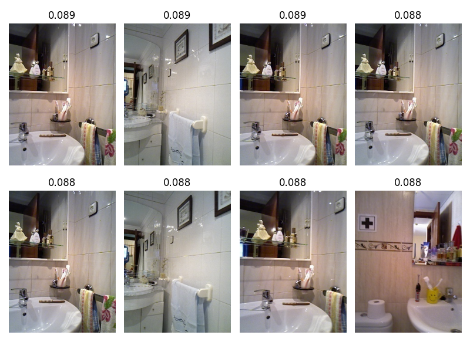

## Semi-experiment: CLIP inference test
```bash
pip install ipywidgets # for jupyter
```
[Jupyter demo](https://github.com/blu-y/cmap/blob/main/ex/semi_exp_clip.ipynb)

##### Init model

##### Rawdata

##### RGBD data

##### Run Clip


##### Result





## Semi-experiment: Visualization
[Jupyter demo](https://github.com/blu-y/cmap/blob/main/ex/semi_exp_viz.ipynb)
##### Load dataset
```python
def load_dataset(sensor=None, scale=None):
    rh = load_rh()
    df = rh.get_sensor_observations('rgbdlsr')
    df = df.sort_values("timestamp")
    df = df.reset_index(drop=True)
    if sensor != None:
        # select RGBD1 camera
        df = df.loc[df.sensor_name==sensor]
        df = df.reset_index(drop=True)
    if scale != None:
        df = df[df.index % 100 == 0]
        df = df.reset_index(drop=True)
    ids = df.id.tolist()
    return rh, df, ids
```
Input: sensor name, scale parameter(1=all, 2=50%, 3=33% data)
Ouptut: rh class, dataframe of dataset, index of dataset
##### Choose particular session
```python
def separate_session(df):
    hsi = df.home_session_id.unique()
    hsi.sort()
    dfs = []
    for i in hsi:
        _df = df.loc[df.home_session_id==i]
        _df = _df.loc[df.sensor_name=="RGBD_1"]
        _df = _df.sort_values(by='room_id')
        _df = _df.reset_index(drop=True)
        counts = _df.room_id.value_counts()
        dfs.append(_df)
    return dfs
```

##### Plot data
```python
def y_to_uv(yaw):
    return np.cos(yaw), np.sin(yaw)

def plot_viewpoint(df, size=1/20, scale=5):
    df = df.sort_values("timestamp")
    df = df.reset_index(drop=True)
    df = df.loc[df.index%scale==0]
    df = df.reset_index(drop=True)
    fig = plt.figure('viewpoint')
    ax = fig.add_subplot(111)
    for index, row in df.iterrows():
        dx, dy = y_to_uv(row['sensor_pose_yaw'])
        ax.arrow(row['sensor_pose_x'], row['sensor_pose_y'], dx*size, dy*size,
                width=0.0005, head_width=0.03, shape='right', overhang=1, fc='blue', ec='blue')
    # ax.plot(df.sensor_pose_x, df.sensor_pose_y)
    ax.set_xlim([df['sensor_pose_x'].min()-0.2, df['sensor_pose_x'].max()+0.2])
    ax.set_ylim([df['sensor_pose_y'].min()-0.2, df['sensor_pose_y'].max()+0.2])
    plt.tight_layout()
    plt.show()
```
Convert yaw data to u,v(dx,dy of arrow)
Use scale parameter not to show all arrows(keyframe selection)
Draw arrow to plot
##### Main function
```python
if __name__ == '__main__':
    rh, df, _ = load_dataset('RGBD_1')
    dfs = separate_session(df)
    df = dfs[0]
    print('home subsession id', df.home_subsession_id.unique())
    print('home id', df.home_id.unique())
    print('room id', df.room_id.unique())
    plot_viewpoint(df, 5)
```
##### Result
