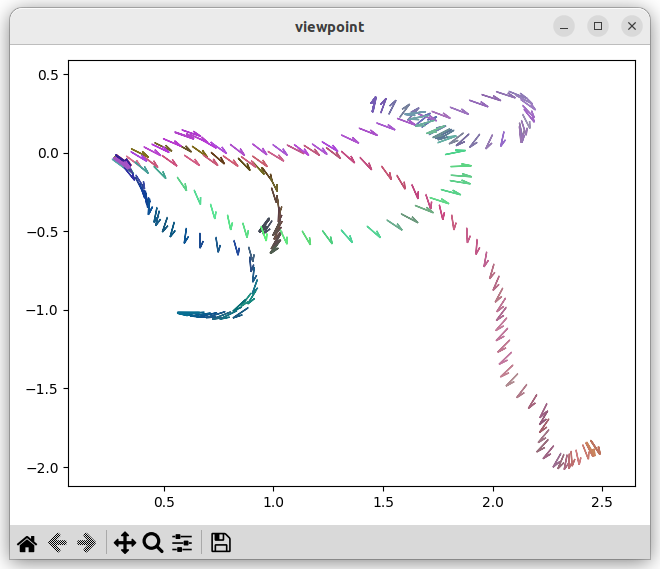
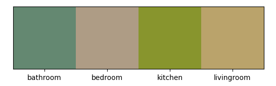
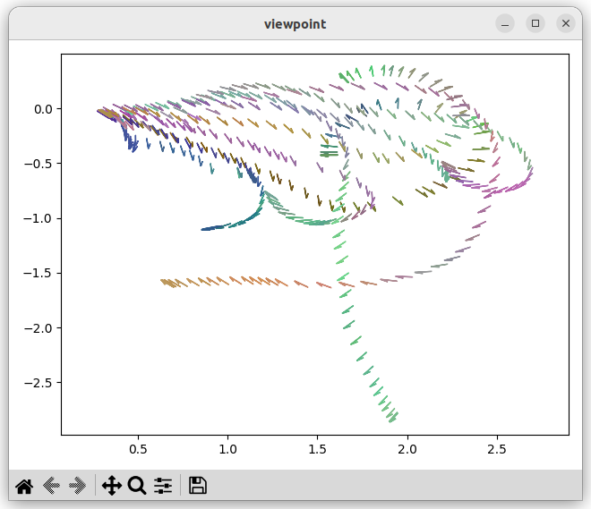

## Dimension Reduction Techniques

#### PCA
```python
class PCA:
    def __init__(self, profile=None, n=3):
        try:
            with open(profile, "rb") as f:
                _profile = pickle.load(f)
            [self.mean, self.std, self.top_evec] = _profile
        except: print("No profile data, use .fit to fit data")

    def fit(self, data, fn=None, n=3):
        data_pca = None
        vec = self.preprocess(data)
        vec = vec.to_numpy()
        self.mean = np.mean(vec, axis=0)
        self.std = np.std(vec, axis=0)
        vec_std = (vec - self.mean) / self.std
        self.cov = np.cov(vec_std, rowvar=False)
        self.eival, self.eivec = np.linalg.eig(self.cov)
        self.ind = np.argsort(self.eival)[::-1]
        sorted_eigenvectors = self.eivec[:, self.ind]
        self.top_evec = sorted_eigenvectors[:, :n]
        self.data_pca = np.dot(vec_std, self.top_evec)
        if fn is None:
            if not os.path.exists('./result'): os.makedirs('./result')
            t = datetime.datetime.now().strftime("%Y-%m-%d_%H-%M-%S")
            fn='./result/pca_profile_'+str(t)+'.pkl'
            with open(fn,"wb") as f:
                pickle.dump([self.mean, self.std, self.top_evec], f)
            print('Profile saved at :', fn)
        else: 
            with open(fn,"wb") as f:
                pickle.dump([self.mean, self.std, self.top_evec], f)
        self.data_pca = pd.DataFrame(self.data_pca, columns=['pca0', 'pca1', 'pca2'])
        print('min :', self.data_pca.min(axis=0))
        print('max :', self.data_pca.max(axis=0))
        
        return pd.concat([data, self.data_pca], axis=1)

    def preprocess(self, df_f):
        # get vectors from df_f
        df_out = pd.DataFrame({col: df_f[col] for col in df_f.columns if isinstance(col, int)})
        return df_out

    def standardize(self, data):
        data = self.preprocess(data)
        return (data - self.mean) / self.std
    
    def transform(self, data):
        data_std = self.standardize(data)
        self.n_data_pca = np.dot(data_std, self.top_evec)
        self.n_data_pca = pd.DataFrame(self.n_data_pca, columns=['pca0', 'pca1', 'pca2'])
        print('min :', self.n_data_pca.min(axis=0))
        print('max :', self.n_data_pca.max(axis=0))
        return pd.concat([data, self.n_data_pca], axis=1)
```
[Jupyter demo](https://github.com/blu-y/cmap/blob/main/ex/dim_reduct_pca.ipynb)  
  
##### Result
잘 나오긴 하였으나, 좌표계가 room 마다 새로시작되는 것 같음.  
데이터를 살펴보니, data의 좌표가 같은 다른 방에 들어갈 때마다 0,0으로 초기화 되는 것을 확인할 수 있었다.  
따라서 방을 전환하는 부분에서 어떻게 변하는지 살펴보기 위해선 직접 dataset을 제작하여야 할 것 같다.  
  
다음은 bathroom, bedroom, kitchen, livingroom에 대해 pca 적용한 결과이다.  
생각보다 각 방의 특징을 잘 나타내지 못하고 눈으로 해당 화살표가 어느 방에 해당하는지 판단하기 어렵다.  
  
text의 정보가 image보다 그렇게 크게 나타나지 않는 듯 하다.  
원래 계획은 아래를 위 사진에 legend 처럼 추가하여 참고하려 하였는데, 그런 방법을 사용하려면 따로 데이터 처리를 하거나, 직접 labeling하거나 labeling 된 데이터의 평균을 구하여 그것을 대푯값으로 활용하여야 할 듯 하다.  
또한 이번 다른 session에서도 실행해봐서 다른 사람의 kitchen에서는 비슷한 색이 나오는지 확인할 필요가 있을 것 같다.  
##### Other session
session2  
 


#### Explained Variance Ratio
```python
EVR = eigenvalue / total_variance
```
Explained Variance Ratio: [0.0796, 0.0644, 0.0522, 0.0445, 0.0371, 0.0337, 0.0282, 0.0248, 0.0231, 0.02, 0.0176, 0.0173, 0.016, 0.0151, 0.0138, 0.0126, 0.0121, 0.0119, 0.0111, 0.0103, 0.0103, 0.0099, ... ]  
Accumulated Explained Variance Ratio: [0.0796, 0.144, 0.1962, 0.2407, 0.2778, 0.3115, 0.3397, 0.3645, 0.3876, 0.4076, 0.4252, 0.4425, 0.4585, 0.4736, 0.4874, 0.5, 0.5121, 0.524, 0.5351, 0.5454, 0.5557, 0.5656, ... ]  

 
 
